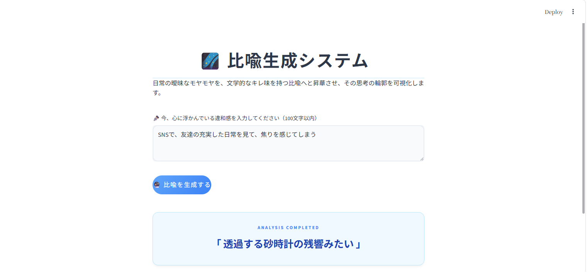
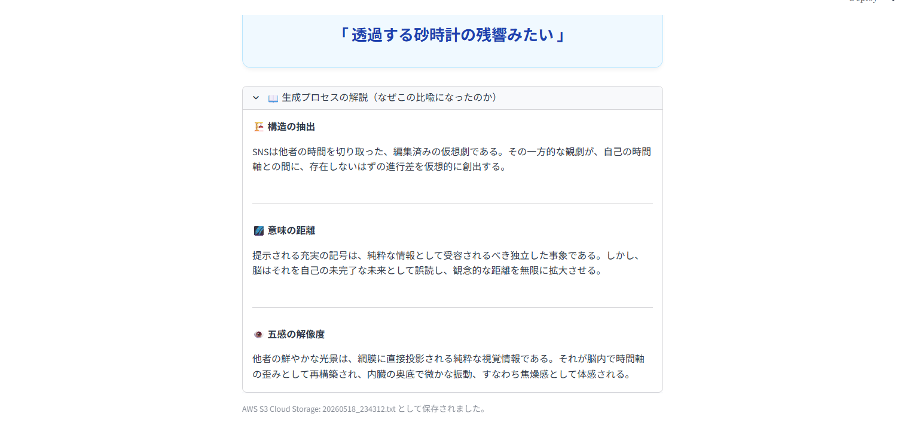

# 比喩生成システム (Metaphor Generator)

ユーザーが日常で抱く言語化できない「モヤモヤ」や「違和感」を抽出し、文学的なキレ味を持つ1行の前衛的な比喩表現へと昇華させるWebアプリケーションです。
単に結果を返すだけでなく、AIがどのような論理でその比喩を導き出したのか、その「思考の輪郭（生成プロセス）」を可視化する機能を備えています。

##  画面イメージ

### 🔹 インターフェース と 生成結果


### 🔹 生成プロセスの可視化 (解説機能)


---

## システムアーキテクチャ & 技術スタック
- **Frontend / GUI:** Streamlit (Custom CSSによる文学的・モダンなUIデザイン)
- **Server / AI Core:** Gemini 2.5 Flash API (Structured JSON Output / Few-Shot Learning)
- **Cloud Infrastructure:** AWS S3 (boto3)
- **Security:** python-dotenv (環境変数の秘匿化・多層入力バリデーション)

---

## アップデート履歴と進化のプロセス

### 🔹 第1弾：コアロジックの構築
ターミナル環境（CUI）にて、Gemini APIとAWS S3を連携させた基本的な比喩生成スクリプトを構築。

### 🔹 第2弾：堅牢性の強化とインフラの永続化
Web公開を見据えたセキュリティガードと、AWS SAAの知識を活かしたデータ設計を導入。
- **多層バリデーション:** `set()`による文字多様性チェック（キー連打等の荒らし対策）、外部ファイル（`ng_words.txt`）と連携したNGワードフィルターの構築（`.gitignore`による秘匿管理）。
- **S3の永続化:** タイムスタンプによる動的ファイル名生成を実装し、クラウド上での上書き問題を解消。

### 🔹 第3弾：GUI化と生成プロセスの可視化 【完成形】
ユーザー体験（UX）とシステム構造を大幅にブラッシュアップ。
1. **StreamlitによるWebアプリケーション化**
   - 文学的な世界観に合わせ、明朝体フォント（Noto Serif JP）や白と水色を基調とした、清潔感と上品さのあるお洒落なUI/UXをカスタムCSSで独自設計。
2. **AIの構造化出力（Structured JSON）とプロセスの可視化**
   - APIの出力を `response_mime_type="application/json"` で完全制御。「構造の抽出」「意味の距離の測定」「五感の解像度」という3つの生成プロセスを、アコーディオンメニューを用いて画面上に美しく可視化。
3. **トレーサビリティの確保**
   - S3へ保存するログデータを拡張し、「元の入力」「生成された比喩」「3つのロジック解説」をすべて内包した構造化テキストとして自動ストックする設計へ変更。

---

## 技術選定の理由
- **Gemini 2.5 Flash (JSON Mode):** 詩的な感性と冷徹な構造分析という相反する出力を高い解像度で両立させ、かつシステム側で確実にパース可能な構造化データ（JSON）を高速に取得するため。
- **Streamlit:** デザインの素早いプロトタイピングが可能であり、Pythonのみでフロントエンドとバックエンドのシームレスなデータ連携を実現できるため。
- **AWS S3:** 将来的なパブリック展開を見据え、拡張性が高く堅牢なストレージインフラに、boto3経由でセキュアにログをデータ永続化するため。

---

## ローカルでの起動方法

1. **必要ライブラリのインストール**
   ```bash
   pip install streamlit google-genai boto3 python-dotenv
