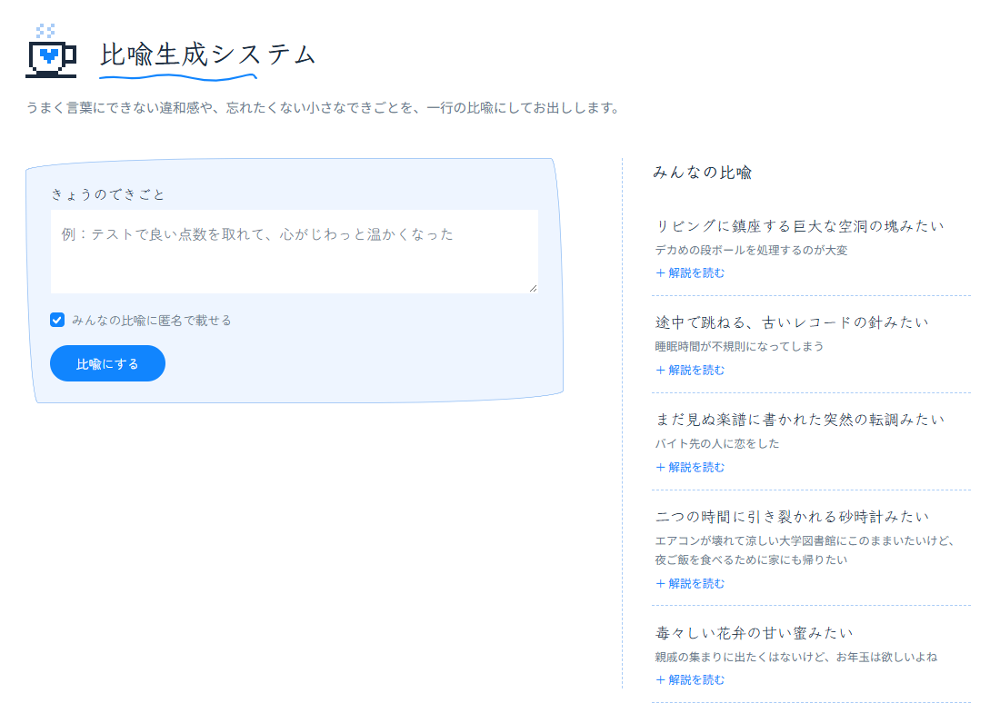
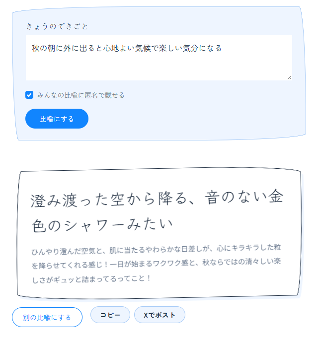
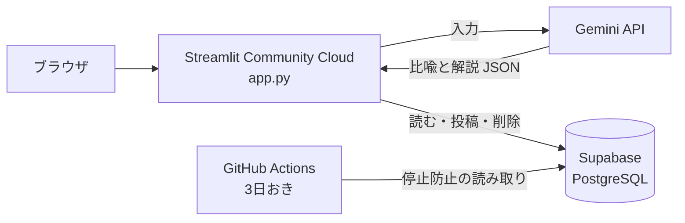

# 比喩生成システム

うまく言葉にできない違和感や、忘れたくない小さなできごとを、一行の比喩にするWebアプリです。

https://metaphor-generator.streamlit.app/




## できること

- できごとや気持ちを入力すると、一行の比喩と、その比喩になった理由の解説が返ってきます
- 気に入らなければ「別の比喩にする」で、前とは違う発想の比喩を出し直せます
- 比喩はコピーしたり、Xにポストしたりできます
- 「みんなの比喩」に匿名で載せて、ほかの人の比喩と解説を読めます

## 構成


```mermaid
flowchart LR
    U[ブラウザ] --> S[Streamlit Community Cloud<br/>app.py]
    S -->|入力| G[Gemini API]
    G -->|比喩と解説 JSON| S
    S -->|読む・投稿・削除| D[(Supabase<br/>PostgreSQL)]
    A[GitHub Actions<br/>3日おき] -->|停止防止の読み取り| D
```

| 役割 | 使っているもの |
|---|---|
| 画面 | Streamlit（カスタムCSS） |
| 比喩の生成 | Gemini API（JSONで出力、Few-Shotの例つき） |
| データベース | Supabase（PostgreSQL、RLS） |
| 運用 | GitHub Actions、Streamlit Community Cloud |

## 設計で気をつけたこと

**誰でも使える公開サービスとしての安全性**
- Supabase の RLS（行単位のアクセス制御）で、匿名ユーザーには「読む」と「投稿する」だけを許可し、直接の書き換え・削除を禁止しています
- 自分の投稿を消せるように、投稿時にランダムな合言葉を発行し、DBにはそのハッシュだけを保存しています。削除は、合言葉を照合するDB関数を通したときだけ実行されます
- 入力や生成結果は、画面に出す前にすべてHTMLエスケープしています

**無料枠を守る**
- 生成は1人10秒おき・1回の訪問で30回まで、サイト全体で1分8回までに制限しています
- Supabase の無料プランは7日間アクセスがないと一時停止するため、GitHub Actions で3日おきに読み取りを送っています

**止まりにくくする**
- Gemini が混雑（5xx）しているときは、1回だけ自動で再試行します
- モデルが提供終了（404）になったときは、予備のモデルに自動で切り替えます。モデル名はコードを書き換えずに設定で変えられます
- エラーは原因ごと（上限・混雑・設定の問題）に、次に何をすればいいかが分かる文言で表示します
- ライブラリのバージョンを固定し、更新で突然動かなくなるのを防いでいます

## ローカルで動かす

```bash
pip install -r requirements.txt
streamlit run app.py
```

`.env`（または `.streamlit/secrets.toml`）に次を設定します。

| 名前 | 内容 | 必須 |
|---|---|---|
| `GEMINI_API_KEY` | Gemini の APIキー | ○ |
| `SUPABASE_URL` | Supabase のプロジェクトURL | ○ |
| `SUPABASE_KEY` | Supabase の anon キー | ○ |
| `GEMINI_MODEL` | 使うモデル（既定：`gemini-2.5-flash`） | |
| `GEMINI_FALLBACK_MODELS` | 予備のモデル（カンマ区切り） | |
| `NG_WORDS` | 弾く言葉（1行に1語） | |

データベースは、Supabase の SQL Editor で [`supabase/schema.sql`](supabase/schema.sql)（テーブル）と [`supabase/policies.sql`](supabase/policies.sql)（アクセス制御）を順に実行して作ります。停止防止の GitHub Actions を使う場合は、リポジトリの Secrets に `SUPABASE_URL` と `SUPABASE_KEY` を登録してください。

## ライセンス

[MIT](LICENSE)
